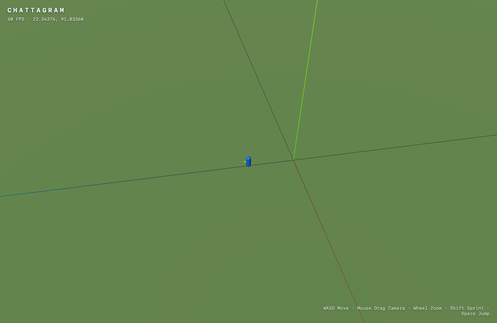

# Milestone 1 — Empty 3D World

**Status:** done
**Spec:** §66 (Milestone 1), §5 (globe), §6 (coordinates), §25–26 (controls/camera)

## Goal

A playable, infinitely-ish curved world you can walk around with a third-person
camera. No real geography yet — this proves the loop, projection, and controls.

## Scope

- [x] Vite + TypeScript strict + Three.js scaffold
- [x] Centralized `WORLD_CONFIG` (bounds, origin, spawn, curvature, chunk size)
- [x] Local projection (`geoToLocal` / `localToGeo`)
- [x] Curved ground surface (`surfaceHeight`) + grid + origin axes
- [x] Daylight lighting rig with shadows
- [x] Keyboard + mouse `Input` collection
- [x] Player avatar + physics (gravity, ground detection, jump, sprint)
- [x] Third-person camera (orbit, zoom, smooth follow)
- [x] `Game` loop wiring it all together
- [x] Minimal HUD
- [x] `npm run dev` / `npm run build` verified

## Success criteria (spec §66)

> I can walk around a 3D world.

- WASD moves relative to camera. ✅ verified — held W, latitude advanced
  `22.34370 → 22.34376` (~4.5 m/s = WALK_SPEED).
- Mouse drag rotates the camera; wheel zooms. ✅ verified via Playwright.
- Shift sprints, Space jumps, gravity pulls the player back to the surface.
- Stable frame rate; no console errors. ✅ 60 FPS; only a favicon 404.

## Verification

- `npm run build` — passes (`tsc --noEmit` clean, Vite build 490 kB / 124 kB gzip).
- Browser: renders at 60 FPS, spawn = `22.34370, 91.83360` (matches `WORLD_CONFIG.spawn`).

## Notes

- No physics engine yet (see ADR-0001). Ground contact is computed directly from
  `surfaceHeight(x, z)`.
- Curvature is a paraboloid approximation (ADR-0003).
