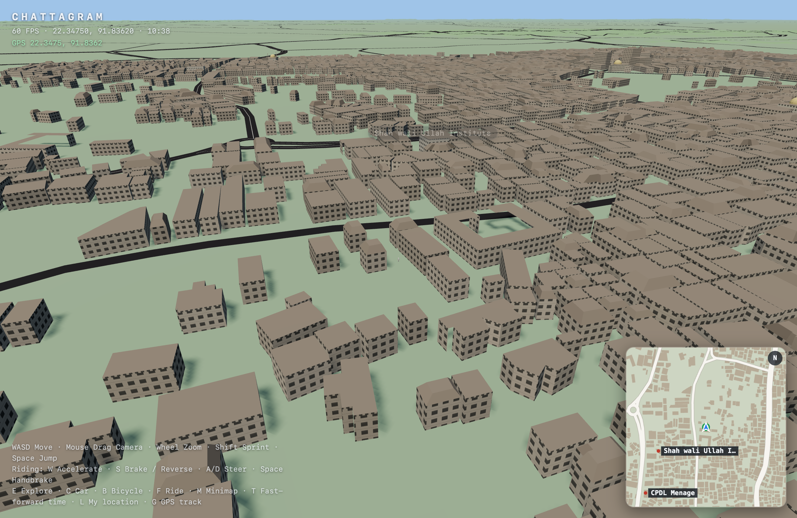

# Milestone 4 — Buildings

**Status:** in progress — spawn district done, city-wide + LOD pending
**Spec:** §12–17, §33, §38, §68–70

## Goal

Populate the world with procedural buildings from real OSM footprints, with real
heights and labels for authentic/named buildings.

## Source decision (important)

Building **geometry** could not be obtained from the public sources we tried:

- **Overpass** — server too busy; `out geom` over even a 0.9 km² tile returned
  `Dispatcher_Client::request_read_and_idx::timeout`.
- **Geofabrik PBF** (354 MB) — correct long-term source, but the download here is
  ~11 KB/s (10 MB in 15 min), so it is impractical right now.

**Chosen:** the **OSM API `map` endpoint** (`/api/0.6/map?bbox=...`), fetched in
small tiled bboxes. Reliable for local areas (≈2.5k nodes in ~1.6 s), no bulk
download. Full-city coverage should later switch to the Geofabrik PBF.

## Spawn district

- Bounds `22.3365–22.3515 N, 91.8265–91.8415 E` (~2.6 km², around Cheragi Pahar,
  the spawn point). Fetched in `0.005°` tiles.
- **6,604 buildings**, 38 named. Heights 3–36 m (avg 9 m).
- Types: mostly `residential`, plus `religious`, `commercial`, `school`.

### Named (authentic) buildings — sample

Anderkilla Shahi Jame Masjid · Municipal Shopping Center · Chittagong City
Corporation · Karnaphuli Tower · Kadam Mobarak Shahi Jame Mosque · Chittagong
Buddhist Bihar · Equity Central · Salam Manjil · Satter Mansion.

## Rendering

- `src/world/Buildings.ts`: each footprint extruded to its estimated height and
  draped on terrain. Walls and roofs are two merged meshes (low draw calls, §38).
- Per-face winding is corrected (outward for walls, up for roofs).
- `src/ui/WorldLabels.ts`: HTML overlay labels for named buildings — fade with
  distance, nearest 12 only, within 400 m (§33).

## Realism pass

- **Window facades**: a procedural `CanvasTexture` (one window per 3 m tile)
  multiplied by vertex color; wall UVs are `u = distance/3`, `v = height/3`.
- **Level rooflines**: wall bottoms follow the terrain (nothing floats) but the
  roof is level at `min(ground) + height`, so walls stay vertical instead of
  shearing along slopes.
- **Parapets** on flat roofs; **hip roofs** on some small residential buildings;
  **domes + minarets** on religious buildings.
- **Per-building color variation** (deterministic hash) so rows don't look cloned.
- `roof:shape`, `building:colour` and `building:levels` are captured by the fetch
  but are essentially absent in this district, so variety is procedural.

### Bug fixed

Non-indexed geometry needs **6 vertices per quad** (two triangles). The first
realism pass pushed only 4, so a triangle was missing from every wall and roofs
rendered inside-out — buildings looked sliced/floating. Fixed by emitting both
triangles per wall quad.

## Height algorithm (§13)

1. `height` / `building:height` (meters)
2. `building:levels` × 3.0
3. type default (residential 9, commercial 14, office 22, hotel 26, …)
4. `unknown` → 7

## Not yet

- City-wide coverage (chunked fetch + LOD, §63) — only the spawn district exists.
- Building detail levels (facades/windows/balconies, §15).
- Multipolygon building relations; building parts (`building:part`).
- Click-to-inspect on labels/POIs (§31–32).
