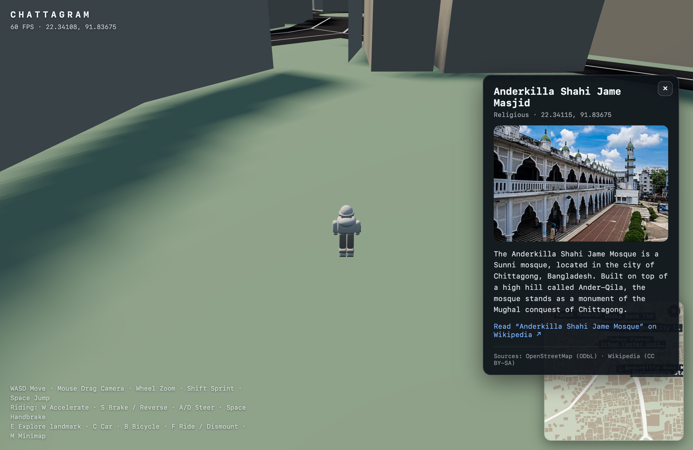
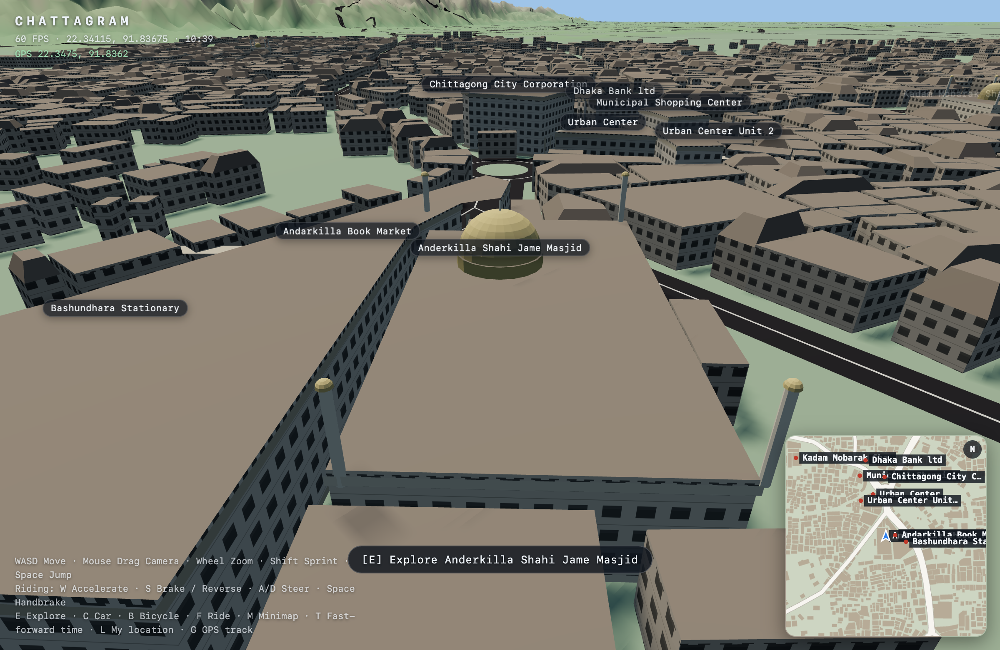

# Milestone 5 — Landmarks & Learning Layer

**Status:** done (spawn district)
**Spec:** §16–17, §31–33a, §70

## Goal

Let the player discover and inspect real Chattogram places, with genuine
educational content.

## Landmark system

- Landmarks are the named buildings from the buildings dataset (OSM `name` tag):
  currently **38** in the spawn district (mosques, schools, markets, towers,
  civic buildings).
- `src/landmarks/LandmarkManager.ts`: finds the nearest landmark within **22 m**,
  shows an `[E] Explore <name>` prompt, opens the panel on **E**, closes on
  **Escape**.
- World labels are also **clickable** and open the same panel.
- `src/ui/LandmarkPanel.ts`: card with name, category, coordinates (WGS84),
  description, image, "Learn more" link, and source attribution.

## Educational enrichment (§33a)

`src/landmarks/LandmarkInfo.ts` resolves content on demand, in order:

1. OSM `wikipedia` tag → Wikipedia summary
2. OSM `wikidata` tag → Wikidata sitelink → Wikipedia summary
3. nearest geotagged Wikipedia article by coordinates (150 m geosearch),
   **only if the article title matches the landmark name** (conservative
   `namesMatch`: containment or ≥60% distinctive-token overlap)
4. fall back to the OSM `description`, else an explicit "no article" message

The name-match guard is important: without it the geosearch fallback showed an
unrelated nearby place (clicking *CPDL Menage* displayed *Chittagong Independent
University*). Now unmatched landmarks say so, rather than showing wrong content.

Live lookups happen only when a panel is opened; nothing is fetched at load.

## Attribution

The panel shows `Sources: OpenStreetMap (ODbL) · Wikipedia (CC BY-SA)` and links
to the OSM way and/or the Wikipedia article. Framing stays "geographically based
on real Chattogram data" (§76–77).

## Type classification

`scripts/fetch-buildings.ts` classifies buildings from tags **and name
heuristics** (masjid/mosque → religious, school/college, hospital, university,
bank/market/tower → commercial). OSM building tags are frequently just
`building=yes`, so names carry most of the signal.

## Verified

Opened **Anderkilla Shahi Jame Masjid**: category `Religious`, coordinates
`22.34115, 91.83675`, Wikipedia image + extract ("…a monument of the Mughal
conquest of Chittagong"), link and attribution all correct.

## Named-building architecture (ADR-0013)

`src/world/LandmarkDetails.ts` gives every named building a plinth, a cornice,
and a type-inspired treatment:

- **Religious** — drummed dome + finial, four corner minarets, arched portal.
- **Civic / commercial / educational** — colonnaded portico + roof slab.

These are stylised interpretations of the real building types (§76–77), added on
top of the procedural shell (which skips its own roof decorations for named
buildings so detail isn't duplicated). Hand-authored Blender GLB hero models for
the most iconic few are the intended next step.

## Not yet

- Clickable 3D raycast selection (labels only, for now).
- Discovery log / completion count (§33a, future).
- Hand-curated descriptions for the top landmarks.
