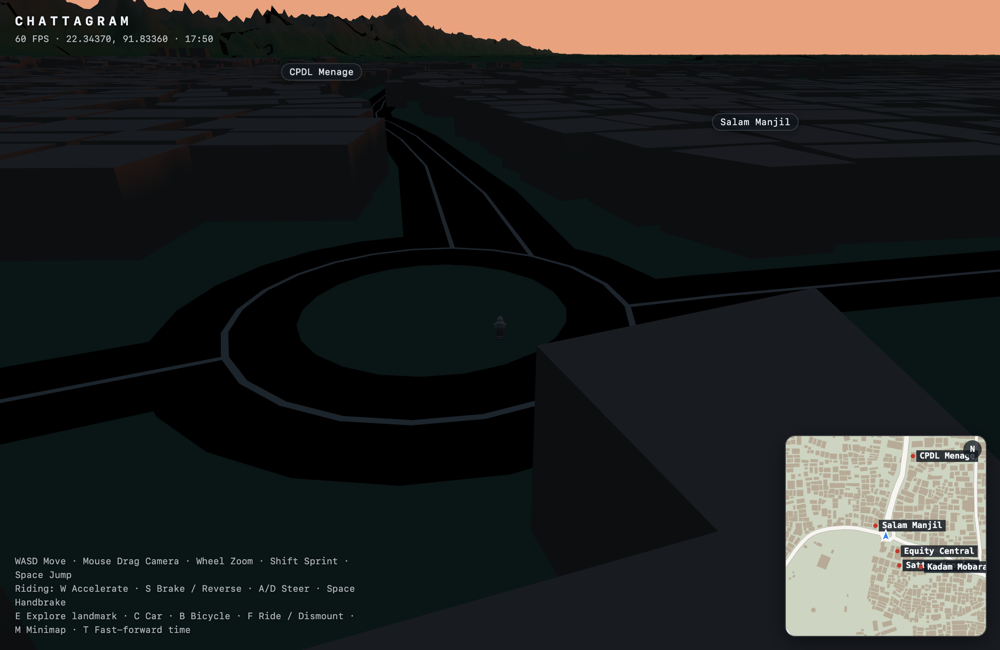
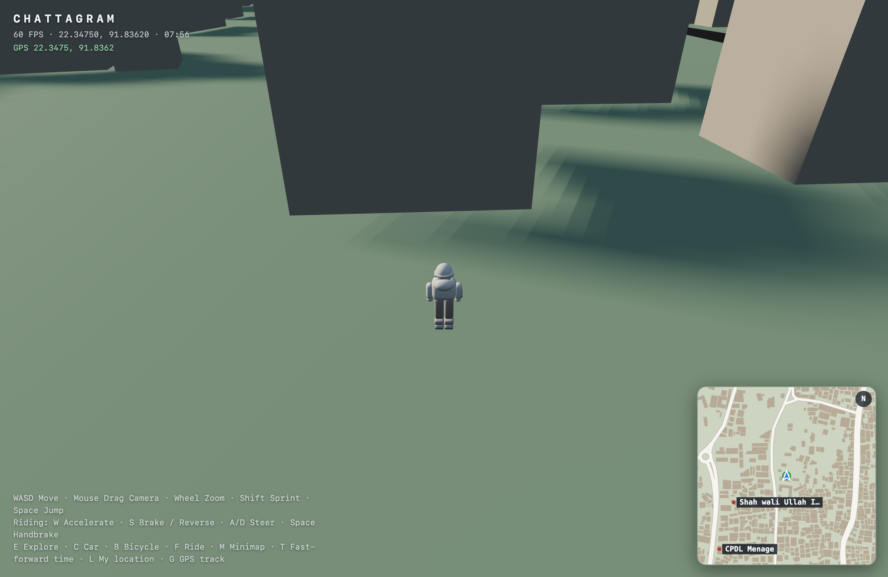

# Milestone 7 — Polish

**Status:** in progress
**Spec:** §34–35, §22–23, §40–41, §57

## Day/Night cycle (done)

- `src/world/TimeOfDay.ts`: one hour value drives everything. A full day is
  `dayLengthSeconds` (default 480 s); holding **T** fast-forwards.
- Sun arc: direction `(cos θ, sin θ, 0.35)` with `θ = (hour − 6)/12·π`; negative
  height at night.
- Sky/fog retint via `SceneManager.setSky`: day blue → warm sunset → dark night.
- `Lighting.applyTimeOfDay`: sun color/intensity, hemisphere ambient, and shadows
  disable when the key light is off.
- **Moonlight**: at night the key light flips to the opposite direction with a
  cool color and a low intensity, and ambient keeps a navigable floor, so night
  is playable (not pitch black).
- Twilight uses `smoothstep` so sunset isn't an abrupt cliff.
- HUD shows the clock (`HH:MM`).

## Device geolocation (done)

- `src/geography/Geolocation.ts`: `getCurrentLocation()` (one-shot) and
  `watchLocation()` (continuous), plus `insideWorldBounds()`.
- On load the game **starts the player at the device's real location** when it
  falls inside the world bounds; otherwise it falls back to `WORLD_CONFIG.spawn`.
- **L** re-requests location and recenters; **G** toggles live GPS tracking (the
  player follows the device as you move).
- HUD shows a `GPS lat, lon` line; the minimap draws a green GPS marker.

## Still pending

- Vegetation (InstancedMesh, §23), roadside props (§41).
- Atmospheric fog tuning, ambient audio (birds/city/traffic, §57).
- Street/building lights at night (§34).
- Settings, loading screen polish (§53).
