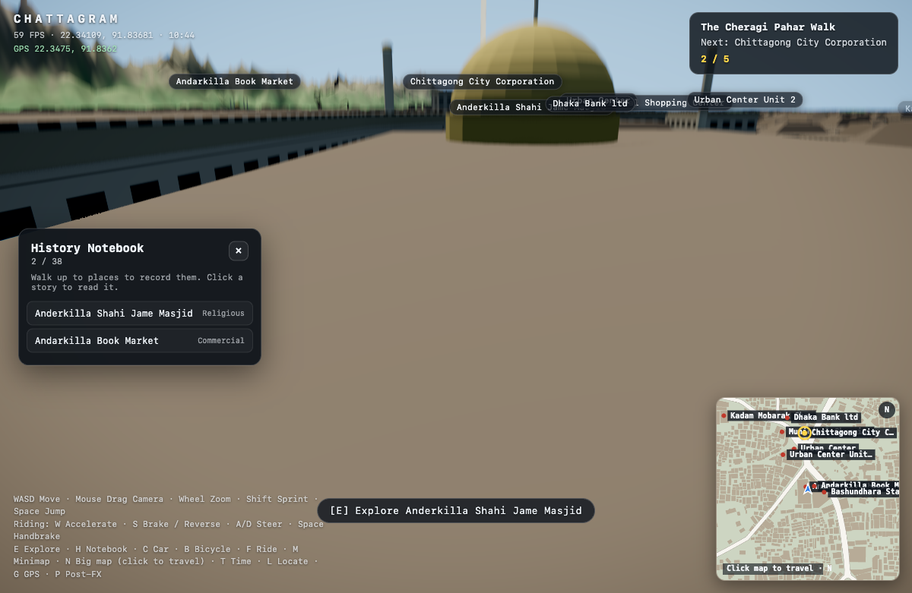

# Milestone 8 — Quests & History Notebook

**Status:** done (first quest)
**Spec:** §33a, §75 (quests / discoveries / "Chattogram walks")
**Inspiration:** Jalan KL (see `references.md`)

## What it does

Turns exploration into a guided experience: a route through real Chattogram
landmarks, a world beacon marking the next objective, a HUD tracker, a discovery
log, and a minimap marker.

## Systems

- `src/quests/quest.ts` — quest data. First quest: **"The Cheragi Pahar Walk"**
  (Anderkilla Shahi Jame Masjid → Andarkilla Book Market → Chittagong City
  Corporation → Municipal Shopping Center → Kadam Mobarak Shahi Jame Mosque).
- `src/quests/QuestManager.ts` — progress state; the first un-done stop is the
  current objective; drives HUD + beacon + map marker.
- `src/world/QuestBeacon.ts` — a tall translucent beam + floating gold octahedron
  above the current objective, visible across the district.
- `src/ui/Notebook.ts` — **History Notebook** (H): discovered places with a
  completion count (`N / 38`); clicking an entry opens its story.
- **Discovery** lives in `LandmarkManager`: walking within 34 m of a named
  building records it (notebook) and completes it if it is a quest stop.
- HUD quest tracker (top-right) and a gold minimap marker for the objective.

## Verified

Travelling to Anderkilla advanced the quest to **2 / 5** and the notebook to
**2 / 38**; the next objective became Chittagong City Corporation; the beacon and
minimap marker followed.

## Not yet

- Multiple quests / a quest picker.
- Story-first content per stop (curated "History / Visit / Sources" tabs).
- Memory questions, stamps, rewards (the notebook is currently a log).
